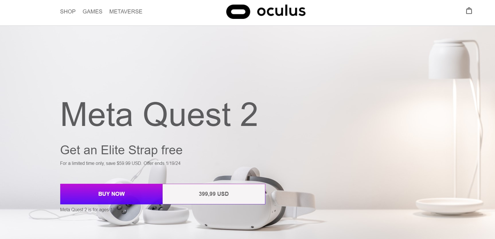

<h1>Oculus web page</h1>

Latest technologies for Virtual Reality

<h2>General Information</h2>

<ul>
<li>This responsive web site is created on pure HTML, CSS and JavaScript</li>
</ul><ul>
<li>Lists of items are styled mostly by CSS grids</li>
</ul><ul>
<li>Live page: https://bogdanglazkov.github.io/oculus-grid-site/</li></ul>
<h2>Technologies Used</h2>

<ul><li>HTML</li>
<li>CSS</li>
<li>JavaScript</li>
<h2>Screenshots</h2>

<h2>Setup</h2>

To set up the project you can clone it from this repo: https://github.com/BogdanGlazkov/oculus-grid-site

<h5>Code Examples</h5><ul>
<li>Here is a code example of Hero (Top) section</li>
</ul>
<code><section class="top">

<h1 class="title">Meta Quest 2</h1>

Get an Elite Strap free
          

For a limited time only, save $59.99 USD. Offer ends 1/19/24

<button class="buy-btn" type="button">BUY NOW399,99 USD</button>

Meta Quest 2 is for ages 13+

</section></code>
<h2>Project Status</h2>

Completed

<h2>Features that can be added</h2>

<ul>
<li>Active links</li>
</ul><ul>
<li>Authorization</li>
</ul>
<h2>Dinamic content</h2>

<ul>
<li>This project was based on @vadymprokopchuk tutorials</li>
</ul><h2>Contact</h2>

